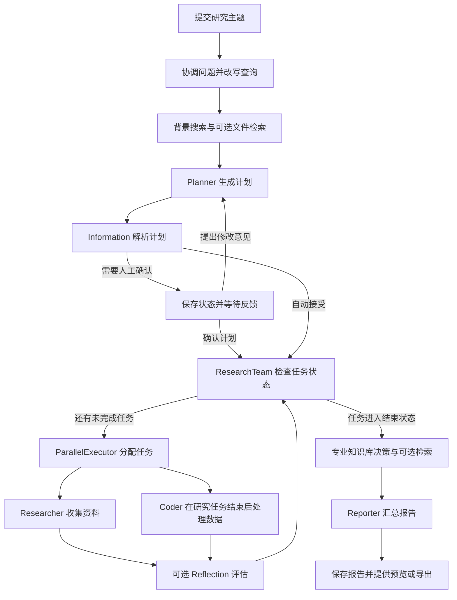

# DeepResearch 项目技术详解

本文对应简历中的六条项目经历，结合当前仓库说明技术原理、选型理由、调用流程和面试时需要讲清楚的细节。代码位置以类名和方法名为主，点击链接可以直接阅读实现。

这里的“实现”表示源码中存在相应逻辑，不代表所有可选功能已经在本机启用或通过运行验证。涉及吞吐、延迟、检索效果的数字，需要实际测试后补充。

## 1. 先看整体架构

这个项目处理的是需要多步调查的问题。例如“比较几种向量数据库，给出适合某个业务的选型建议”，需要先明确比较维度，再查资料、整理数据，最后形成有依据的结论。

后端使用 Spring Boot 提供接口，Spring AI 对接模型与工具，Spring AI Alibaba Graph 管理研究步骤之间的关系。Elasticsearch 负责知识检索，Docker 提供 Python 执行环境，Reactor 和 SSE 把执行过程传给前端。

| 技术 | 在项目中的作用 | 选择它的理由与代价 |
| --- | --- | --- |
| Java 17 / Spring Boot | HTTP 接口、依赖注入、配置装配、服务组织 | 能与现有 Java 工程体系配合；业务线程与响应式调用的边界需要处理 |
| Spring AI | ChatClient、模型调用、工具回调、文档和向量库接口 | 减少模型接入的重复代码；仍需理解各模型及工具的差异 |
| Spring AI Alibaba Graph | 节点、条件边、共享状态、检查点 | 适合有分支、循环与人工介入的任务；比单次模型调用多了状态管理成本 |
| Elasticsearch | 全文搜索、向量搜索、元数据过滤 | 一个检索系统承载关键词和语义查询；需要维护索引、Embedding 维度和查询兼容性 |
| Redis | 可选的报告存储 | 便于按任务 ID 读取报告；报告有过期时间，会话索引仍有内存部分 |
| Reactor / SSE | 模型流、节点事件和浏览器增量展示 | 用户能及时看到进度；需处理慢消费者、断开连接和取消传播 |
| Tool Calling / MCP | 搜索、抓取、代码执行及外部工具接入 | 把模型决策连接到实际操作；增加外部服务延迟和故障处理成本 |
| Docker | 执行 Python 分析代码 | 把执行环境与 Java 服务分开；需要容器启动、依赖安装和资源回收 |

下面是研究主流程的简化图。它省略了短期记忆和部分知识库分支；完整边关系见 `DeepResearchConfiguration.deepResearch()`。



源码入口：[pom.xml](pom.xml)、[DeepResearchConfiguration.java](src/main/java/com/alibaba/cloud/ai/example/deepresearch/config/DeepResearchConfiguration.java)、[ChatController.java](src/main/java/com/alibaba/cloud/ai/example/deepresearch/controller/ChatController.java)。

## 2. 多 Agent 编排：把复杂问题拆成可管理的步骤

### 2.1 Agent 在这里是什么

可以把一个 Agent 理解为“模型 + 角色提示词 + 可用工具 + 当前任务上下文”。Planner 与 Researcher 即使使用同一个底层模型，也可以因为任务目标、提示词和工具不同而承担不同职责。

| 角色 | 主要输入 | 主要输出 |
| --- | --- | --- |
| Planner | 用户问题、背景信息、文件检索结果、人工意见 | 可解析为 `Plan` 的研究计划 |
| Researcher | 分配到的研究步骤及历史反思意见 | 搜索和阅读后整理的研究结果 |
| Coder | 处理步骤、研究观察结果及历史反思意见 | Python 分析结果及说明 |
| Reporter | 研究计划、各步骤结果、可用知识库内容 | 最终研究报告 |

简历用四类角色概括主线。实际图中还包括 Coordinator、Information、HumanFeedback、ParallelExecutor 等控制节点，并非每个节点都调用大模型。

### 2.2 为什么使用 Graph

如果流程只是“问一次模型，再返回答案”，普通的 `ChatClient` 调用就够了。这个项目还需要人工改计划、并行研究、失败后的再次处理，以及对过程的展示。

Graph 将这些关系显式写出来：

- `StateGraph` 定义有哪些节点、节点如何连接。
- `NodeAction` 读取状态、执行工作并产生状态更新。
- 条件边根据状态决定下一步，例如回到 Planner 或进入研究组。
- `CompiledGraph` 承担实际运行，`RunnableConfig.threadId` 标识这一次图执行。

代码中经常使用 `OverAllState` 保存 `query`、`current_plan`、`observations`、`final_report` 等字段。`ReplaceStrategy` 表示某个键收到新值后替换旧值，不会自动追加或合并列表；需要累加的结果必须明确组织好。

### 2.3 计划如何从模型输出变成可执行数据

`PlannerNode` 将用户问题、背景资料、人工意见等组成消息，使用 `BeanOutputConverter<Plan>` 提供结构化输出要求。模型返回的 `planner_content` 随后由 `InformationNode` 解析。

这里不能把“提示模型返回 JSON”当成“模型一定返回合法 JSON”。`InformationNode` 捕获解析异常，在计划迭代次数未达到上限时跳回 Planner，超过上限则结束流程。

解析成功后，系统把 `Plan` 放入 `current_plan`，再根据 `auto_accepted_plan` 决定直接执行还是等待人工确认。

### 2.4 并行任务如何分配

`DeepResearchConfiguration` 按配置创建多个 `researcher_i` 和 `coder_i` 节点。`ParallelExecutorNode.apply()` 遍历计划步骤：

1. 跳过已经有执行结果或已经分配状态的步骤。
2. 对 `RESEARCH` 步骤轮询分配 Researcher，节点编号按配置数量取模。
3. 对 `PROCESSING` 步骤，先检查研究步骤是否都进入结束状态，再分配 Coder。
4. 工作节点从计划中找出属于自己的步骤，执行后写回结果及状态。
5. `ResearchTeamNode` 检查是否仍有未结束任务，决定继续分配还是进入后续报告流程。

例如有两个 Researcher、四个研究步骤，可以分为 `R1/R3 → researcher_0`、`R2/R4 → researcher_1`。这是轮询分配，不是根据实时耗时动态抢占的工作窃取调度。

当前依赖判断是按阶段进行的：研究阶段结束后才安排处理步骤，并没有为每个步骤建立任意的 `dependsOn` 依赖图。另外，代码把 `COMPLETED` 和 `ERROR` 都视为结束状态。因此“研究完成后分析”更准确的技术含义是研究任务不再处于运行或等待状态，不保证所有研究步骤均成功。

### 2.5 并行带来的取舍

并行可以重叠不同研究任务等待网络和模型响应的时间，但并行数增加也会增加模型请求数、搜索额度消耗，以及触发上游限流的机会。它不会自动减少 Token 总量。

面试时可以解释为：“我把任务分成研究和处理两个阶段，先保证依赖顺序，再在研究阶段内并行。并行度通过节点数量控制，具体开多大需要结合上游限流和任务耗时测试。”

源码：[PlannerNode.java](src/main/java/com/alibaba/cloud/ai/example/deepresearch/node/PlannerNode.java)、[InformationNode.java](src/main/java/com/alibaba/cloud/ai/example/deepresearch/node/InformationNode.java)、[ParallelExecutorNode.java](src/main/java/com/alibaba/cloud/ai/example/deepresearch/node/ParallelExecutorNode.java)、[ResearchTeamNode.java](src/main/java/com/alibaba/cloud/ai/example/deepresearch/node/ResearchTeamNode.java)。

## 3. RAG：让回答能使用检索到的资料

### 3.1 文档如何进入知识库

RAG 是先找资料，再让模型结合资料回答。它不需要把每份新文件都拿去训练模型，但检索到错误或不相关的内容时，回答仍可能出错。

本项目的文档摄入流程主要在 `VectorStoreDataIngestionService`：

```text
文件或资源
  → TikaDocumentReader 提取文本
  → TokenTextSplitter 切分文本
  → 补充文件、用户、会话、来源等元数据
  → VectorStore.add()
  → 生成向量并写入配置的向量存储
```

切分的意义是把长文档变成可检索、可放进模型上下文的片段。片段过长会混入无关内容，过短可能丢掉定义、条件和上下文；大小要结合文档类型与检索样例调整。

`source_type` 用于区分用户上传和专业知识库内容；`session_id`、可选的 `user_id` 等字段用于限定检索范围。专业知识库文档还可以带 `kb_id`、类别等信息。

### 3.2 BM25 和 KNN 各负责什么

BM25 是关键词相关性评分，依赖词项匹配。它适合精确的产品名、错误码和专业术语。例如查询某个异常类名时，包含原词的文档通常很有价值。

向量检索先把问题转换为 Embedding，再找语义上接近的文档片段。用户问“请求太多时如何保护服务”，资料写的是“限流与流量控制”，即使关键词不完全重合，也可能通过语义找到。

单独使用关键词查询可能遗漏换一种说法的内容；单独使用向量查询可能把语义近似但细节不同的内容排在前面。双路召回的目的是让两种信号互相补充，效果需要用真实问题验证。

项目的 `RrfHybridElasticsearchRetriever.search()` 先调用 `EmbeddingModel.embed()`，构造针对 `embedding` 字段的 KNN 请求；启用混合检索时，再添加针对 `content` 字段的 `match` 查询以及 RRF 排序参数。

这里的“双路”指 ES 搜索中的关键词与向量两种召回方式，不代表 Java 端自己启动两个线程调用两次搜索接口。

### 3.3 为什么需要 RRF

关键词得分和向量相似度的量纲不同，直接相加需要处理尺度问题。RRF 使用排名融合：

```text
RRF(d) = Σ 1 / (k + rank_i(d))
```

`rank_i(d)` 是文档在第 i 路结果中的名次，从 1 开始；没有出现在该路中的文档不获得该路分数。`k` 是平滑常数，不能和 KNN 返回条数混淆。[Elastic 官方 RRF 说明](https://www.elastic.co/guide/en/elasticsearch/reference/8.15/rrf.html)

举一个计算示例，取 `k = 60`：

| 文档 | 关键词排名 | 向量排名 | RRF 得分 |
| --- | --- | --- | --- |
| A | 1 | 3 | `1/61 + 1/63 ≈ 0.03227` |
| B | 2 | 1 | `1/62 + 1/61 ≈ 0.03252` |
| C | 3 | 未召回 | `1/63 ≈ 0.01587` |

因此 B 排在 A 前面。这个例子只演示公式，不是项目测试数据。

代码中有两处不同层次的 RRF：

- `RrfHybridElasticsearchRetriever` 把 RRF 参数交给 Elasticsearch，融合关键词和向量结果。
- `RrfFusionStrategy` 在 Java 侧融合结果列表；作为后处理器时，会按 `source_type` 分组后计算排名分数。

后者不是用一个专门的交叉编码模型重新计算“问题与文档”的语义相关性。不能仅因为方法名里有 `rerank`，就把它描述成模型重排。

### 3.4 MultiQuery 和 HyDE 的区别

**MultiQuery** 从一个问题扩展出多个查询角度。例如“选型向量数据库”可以补充索引性能、混合查询、部署运维等角度，再分别检索。

**HyDE** 则先让模型生成一段可能回答问题的文本，再用这段文本帮助语义检索。假设文本的作用是构造检索线索，不能当作真实资料引用。[HyDE 原论文](https://arxiv.org/abs/2212.10496)

本项目 `DefaultHybridRagProcessor.preProcess()` 的顺序是：可选翻译 → 可选 MultiQuery → 可选 HyDE。`HyDeTransformer` 将生成的假设文本替换到查询对象中，生成结果为空时返回原查询。

有两个实现细节需要注意：

- 当前 `hybridRetrieve()` 使用普通 `for` 循环遍历扩展查询，没有把多个查询自动并行化。
- HyDE 替换后的文本会继续进入统一检索流程；在混合检索分支里，它也会影响关键词查询，不只是向量输入。这可能带来额外关键词，也可能引入偏离原问题的内容。

扩展查询和假设文档都需要额外模型调用。更大的检索覆盖范围，要与响应时间和调用成本一起评估。

### 3.5 过滤、去重与配置

`buildFilterExpression()` 根据 `source_type`、`session_id`、`user_id` 构造条件。ES 检索器当前将这些条件作为 `postFilter` 传入，因此要区分“最终结果经过过滤”和“候选向量在检索前已经缩小范围”。后过滤可能让返回数量少于预期，需要用小范围数据验证召回数量。

检索结果进入后处理前会按文档 ID 或内容去重。元数据过滤提供检索范围控制，但用户身份是否可信、是否有权访问某个会话，需要由接口鉴权保证，不能把过滤条件本身当作完整权限系统。

源码提供 `simple` 与 `elasticsearch` 两种向量存储。只有 RAG 启用、选择 Elasticsearch 且混合检索开关开启时，才会走这里描述的 ES 混合检索分支。`RagProperties` 的类内默认值中，RAG、MultiQuery、HyDE 均未开启；实际是否生效还取决于部署配置覆盖。

Java 侧 RRF 还存在一个需要实测的配置点：`RrfFusionStrategy` 默认 `k = 60`、阈值 `0.1`。假设两路结果都把同一文档排第一，分数也只有约 `0.03279`；默认阈值可能使多来源融合结果被全部过滤。单来源分支直接截取 TopK，不走相同的阈值逻辑。这个判断来自源码和公式，本文没有修改该实现。

### 3.6 面试怎么讲、怎么验证

可以这样解释：“精确术语交给关键词检索，表达方式变化交给向量检索，再用排名融合。MultiQuery 和 HyDE 是可选增强，我会用相同问题集比较它们增加的召回是否值得额外延迟。”

验证时准备包含精确词、同义表达、跨段信息和无答案问题的小型问题集，人工标记应该召回的片段。分别比较 BM25、向量、混合检索和查询增强后的 Recall@K、排序质量、响应时间与模型调用量。这里列的是验证方法，不代表已经得出了提升比例。

源码：[VectorStoreDataIngestionService.java](src/main/java/com/alibaba/cloud/ai/example/deepresearch/service/VectorStoreDataIngestionService.java)、[DefaultHybridRagProcessor.java](src/main/java/com/alibaba/cloud/ai/example/deepresearch/rag/core/DefaultHybridRagProcessor.java)、[RrfHybridElasticsearchRetriever.java](src/main/java/com/alibaba/cloud/ai/example/deepresearch/rag/retriever/RrfHybridElasticsearchRetriever.java)、[RrfFusionStrategy.java](src/main/java/com/alibaba/cloud/ai/example/deepresearch/rag/strategy/RrfFusionStrategy.java)、[HyDeTransformer.java](src/main/java/com/alibaba/cloud/ai/example/deepresearch/rag/transformer/HyDeTransformer.java)、[RagProperties.java](src/main/java/com/alibaba/cloud/ai/example/deepresearch/config/rag/RagProperties.java)。

## 4. Checkpoint、HITL 与 Reflection

### 4.1 检查点保存的是什么

研究任务的状态包括用户问题、生成的计划、步骤结果和下一步所需信息。用户审核计划时，如果只是让请求线程一直等待输入，会长时间占用连接和运行资源。

Checkpoint 的作用是保存图状态，让当前执行能停在一个明确位置；后续请求使用同一个 `threadId` 找到状态，再继续执行。

`ChatController` 编译图时注册 `MemorySaver`，并调用 `interruptBefore("human_feedback")`。因此这里的暂停是图的业务中断，不等于把 Java 线程挂起，也不是任意时刻都能冻结一个外部 HTTP 请求。

### 4.2 人工确认和修改如何继续流程

`InformationNode` 决定是否进入人工审核。`/chat/resume` 收到反馈后，大致完成以下操作：

1. 用 `threadId` 构造 `RunnableConfig`。
2. 通过 `compiledGraph.getState()` 取得 `StateSnapshot`。
3. 取出 `OverAllState`，设置恢复标记和人工反馈数据。
4. 调用 `fluxStreamFromInitialNode()` 继续图执行。

`HumanFeedbackNode` 读取 `feedback`：确认时进入研究组；否定时把 `feedback_content` 放入状态，路由回 Planner。Planner 会把修改意见加入下一轮提示消息。这个流程允许用户修正研究方向，避免错误计划一路执行到底。

虽然恢复方法名含有 `InitialNode`，传入的是已经标记恢复的状态。不能仅根据方法名就断言它会把所有历史步骤重新跑一遍。

### 4.3 Reflection 如何重做步骤

人工审核解决的是“研究方向对不对”，Reflection 关注的是“某一步的结果是否达到要求”。

步骤执行完成后，可以先进入等待反思状态。`ReflectionProcessor` 把步骤标题、任务说明和执行结果交给反思模型，并将结果解析为 `ReflectionResult`：

- 通过：把步骤标为完成。
- 不通过：保存反思记录，标记为等待重新处理。
- 再执行：清空旧执行结果，将历史反思意见加入任务消息，重新处理该步骤。

要防止任务无限循环，需要区分三种上限：图整体的 `maxIterations`、研究计划的迭代上限、单步骤的反思上限。它们分别控制不同层次的循环。

当前实现达到反思次数上限会强制标记完成；反思调用或解析异常时也会默认通过。这是在流程继续执行和严格质量判断之间做出的取舍，不能解释成“经过反思就保证结果正确”。

### 4.4 恢复能力的边界

当前检查点使用 `MemorySaver`，不能据此宣称进程重启后仍可恢复研究。跨实例恢复还涉及共享状态存储、任务所有权、重复执行与幂等处理，这些并不会因为接入了 Redis 报告存储而自动获得。

面试时可以说：“我支持在人工审核点保存状态并继续执行。当前检查点在进程内，重启恢复需要持久化 Saver；涉及有副作用的工具时，还需要给操作增加幂等控制。”

源码：[ChatController.java](src/main/java/com/alibaba/cloud/ai/example/deepresearch/controller/ChatController.java)、[HumanFeedbackNode.java](src/main/java/com/alibaba/cloud/ai/example/deepresearch/node/HumanFeedbackNode.java)、[ReflectionProcessor.java](src/main/java/com/alibaba/cloud/ai/example/deepresearch/util/ReflectionProcessor.java)、[ResearcherNode.java](src/main/java/com/alibaba/cloud/ai/example/deepresearch/node/ResearcherNode.java)、[CoderNode.java](src/main/java/com/alibaba/cloud/ai/example/deepresearch/node/CoderNode.java)。

## 5. Reactor、Sinks 与 SSE：把研究过程展示出来

### 5.1 三者分别解决什么问题

`Flux` 描述一个可以产生多个元素的异步数据流。模型会逐步产生文本，图会陆续产生节点输出，它们都适合用流来表示。

`Sinks.Many` 是程序主动向流中发送数据的入口。`GraphProcess` 将图输出转为前端需要的事件后，调用 `tryEmitNext()`；Controller 再把 `sink.asFlux()` 返回给 HTTP 层。

SSE 是浏览器接收服务器事件的 HTTP 格式。它适合本项目这种以服务端持续输出为主的交互：研究进度和报告内容从后端推向前端，人工反馈则通过单独的请求提交。

```text
模型流 / 图节点输出
  → Flux<NodeOutput>
  → GraphProcess 区分节点事件与模型增量
  → ServerSentEvent<String>
  → Sinks.Many
  → HTTP text/event-stream
  → 前端解析事件并更新页面
```

### 5.2 为什么选择 SSE

普通轮询需要前端反复询问任务是否有新进度；SSE 允许后端沿一个响应持续发送内容。对于以文本和进度更新为主的研究过程，交互模型比较直接。

项目 `/chat/stream` 和 `/chat/resume` 都是 POST 接口，并返回 `text/event-stream`。前端 `XStreamBody.readStream()` 使用 `fetch()` 获取响应体，再通过 `XStream` 解析。不能把这里的实现描述成浏览器原生 `EventSource` 直接发 POST。

SSE 改善的是结果和进度的可见性。它不会自动让模型计算更快，因此不能把“用户更早看到输出”直接写成“整体研究耗时下降”。

### 5.3 节点事件与模型文本如何区分

`GraphProcess.processStream()` 接收 `Flux<NodeOutput>`，遇到 `StreamingOutput` 时调用 `buildLLMNodeContent()`，提取增量文本、步骤标题、结束原因及任务标识；普通节点输出则交给 `buildNormalNodeContent()`，组织节点名、展示标题、内容和来源信息。

任务正常完成时调用 `tryEmitComplete()`。流发生异常时，当前实现先尝试发一个 `nodeName = "__END__"` 的业务事件，再向 Sink 传播异常；Controller 还有对应的流异常处理。

业务结束事件用于让页面表达“任务为什么结束”，响应流完成或出错则负责终结传输，两者作用不同。事件是否成功发送，应结合 `tryEmitNext()` 的结果和连接状态判断；当前调用没有逐一处理所有发送失败情况。

### 5.4 背压与缓冲需要讲清楚

代码使用 `Sinks.many().unicast().onBackpressureBuffer()`。`unicast` 适合一个订阅者，缓冲可以暂存下游尚未消费的事件，但默认缓冲并不是一个自动受业务容量约束的队列。[Reactor Sinks 官方说明](https://projectreactor.io/docs/core/release/reference/coreFeatures/sinks.html)

如果模型输出很快、浏览器接收很慢，缓冲可能持续增长。若要进一步改进，可以测试有界缓冲、文本增量合并和慢连接关闭策略。重要的结束事件和普通文本增量也应采用合适的保留策略。这些是可讨论的改进方案，并非当前源码已经完整实现的能力。

### 5.5 任务停止和订阅取消的区别

`GraphProcess` 用 `ConcurrentHashMap<GraphId, Future<?>>` 保存任务，`stopGraph()` 查找对应 Future 并尝试取消。需要特别区分当前的两个重载：

- 旧的 `AsyncGenerator` 版本会在工作线程中持续取结果，并检查线程中断。
- 当前 `Flux` 版本在提交的任务里调用 `subscribe()`，但没有保存返回的订阅对象。

据此可以发现一个需要验证的边界：提交任务的 Future 结束，不代表响应式订阅也结束；取消这个 Future，也不能据此保证模型请求、工具调用和容器任务都被取消。

此外，`/chat/resume` 内部创建了新的 `GraphProcess`，它的任务映射与 Controller 原有实例不同；`/chat/stop` 使用的是原有实例。恢复后的任务能否被同一停止入口正确找到，需要单独验证。客户端断开时，当前 `doOnCancel` 主要记录日志，也不能当成完整的后台取消链路。

简历里的“暂停”对应计划审核处的业务中断，源码没有单独的通用 `/pause` 接口。面试被追问时，应把“提供任务控制入口”和“所有下游都能可靠取消”区分开。

源码：[GraphProcess.java](src/main/java/com/alibaba/cloud/ai/example/deepresearch/controller/graph/GraphProcess.java)、[前端 stream.ts](ui-vue3/src/utils/stream.ts)、[前端 chat.ts](ui-vue3/src/services/api/chat.ts)。

## 6. Tool Calling 与 MCP：模型如何调用外部能力

### 6.1 Tool Calling 的完整过程

模型本身不会直接执行 Java 方法。系统先把工具名称、用途、参数结构告诉模型；模型根据任务生成工具调用请求，应用执行对应方法，再把结果交回模型。

以搜索为例：

```text
研究任务：查找某个技术方案的公开资料
  → 模型选择搜索工具并生成查询参数
  → 应用调用实际搜索服务
  → 返回标题、链接或摘要
  → 按需抓取页面正文
  → 模型整理证据并继续研究
```

工具描述直接影响模型是否选对工具。参数结构则让模型输出可以被应用解析，但工具执行前仍需做参数检查，并处理外部服务返回的错误。

项目的 `PythonReplTool.executePythonCode()` 就是一个直观例子：`@Tool` 暴露操作描述，`@ToolParam` 描述代码和依赖参数，真正创建容器和执行代码的是 Java 逻辑。

### 6.2 Tavily 与 Jina 的分工

搜索负责发现候选资料，抓取负责取得页面正文。只有搜索摘要时，可能缺少定义、实验条件或结论的限定范围；需要进一步读取原文，才能让研究结果有足够依据。

项目接入搜索服务和 Jina 抓取能力，还提供 `SearchFilterService` 处理搜索结果。具体使用哪家搜索服务、工具是否可用，要看模型和搜索配置以及对应服务是否装配成功。

不能把“能返回一个链接”当成“这个链接足以支持结论”。研究节点需要保留资料出处，并结合正文内容整理结果；Reflection 可以检查结果，但不能代替来源核验。

### 6.3 MCP 与普通工具方法的关系

Tool Calling 解决模型如何表达“我要调用哪个工具”。MCP 负责模型应用与外部工具服务之间的连接和能力暴露。两者可以配合：外部 MCP 工具被转换为 Spring AI 的工具回调，再供模型调用。

在这个项目里，核心路径是：

```text
Agent 名称 + 图状态中的请求配置
  → McpProviderFactory
  → 获取并合并 Agent 对应服务配置
  → 创建 Transport
  → 创建并初始化 McpAsyncClient
  → AsyncMcpToolCallbackProvider
  → ChatClient 请求的 toolCallbacks
```

### 6.4 为什么按角色分配工具

Researcher 更需要搜索和资料读取，Coder 更需要分析与执行。让不同角色拿到合适的工具，可以让工具列表更贴近当前任务，也方便检查某个节点实际能调用什么。

这里的“按角色分配”属于工具配置组织方式，不应扩展成项目已经具备了完整的用户级授权系统。

`McpConfigMergeUtil` 先复制静态配置，再合并请求中的临时配置。服务列表以 URL 作为合并键：相同 URL 的动态项覆盖旧项，新 URL 追加，禁用项在创建连接时跳过。

当前使用的是 `WebFluxSseClientTransport`，默认 SSE 端点为 `/sse`。这是本仓库所用实现，不能据此宣称它已经覆盖所有 MCP 传输方式。

### 6.5 动态接入的代价

`McpClientUtil.createMcpProvider()` 动态创建客户端，并调用 `initialize().block(Duration.ofMinutes(2))` 等待初始化。因此“AsyncClient”这个类型名不代表整条初始化路径完全不阻塞。

遇到客户端创建异常时，方法记录错误并返回 `null`。节点可以不挂载该 MCP Provider，但后续是否仍能完成任务，取决于剩余工具是否满足任务需求。

这条创建路径本身没有展示完整的跨请求客户端池，也不能证明客户端关闭、失败重试和连接复用已全部处理。如果面试讨论优化，可以从连接复用、初始化时延和资源释放着手，先确认生命周期再增加缓存。

源码：[McpProviderFactory.java](src/main/java/com/alibaba/cloud/ai/example/deepresearch/service/McpProviderFactory.java)、[McpClientUtil.java](src/main/java/com/alibaba/cloud/ai/example/deepresearch/util/mcp/McpClientUtil.java)、[McpConfigMergeUtil.java](src/main/java/com/alibaba/cloud/ai/example/deepresearch/util/mcp/McpConfigMergeUtil.java)、[SearchFilterService.java](src/main/java/com/alibaba/cloud/ai/example/deepresearch/service/SearchFilterService.java)。

## 7. Docker：执行模型生成的 Python 代码

### 7.1 为什么需要一个执行环境

模型适合生成分析步骤和代码，但数值计算、统计处理和代码正确性需要实际执行才能知道。直接在 Java 服务所在环境运行生成代码，会把依赖和执行资源与后端服务混在一起。

容器为每次代码执行提供相对独立的环境，任务结束后可以回收。它同时引入了启动和安装依赖的耗时，适合放在 Coder 所承担的数据处理步骤中。

### 7.2 一次执行经历哪些步骤

`PythonReplTool.executePythonCode()` 的主要流程：

1. 检查代码、Docker 地址、镜像名以及资源参数。
2. 创建临时目录，写入 `script.py` 与 `requirements.txt`。
3. 创建一个 Volume 存放 Python 第三方依赖。
4. 按配置安装依赖，然后创建实际执行代码的容器。
5. 通过 `timeout -s SIGKILL ... python3 script.py` 执行代码。
6. 等待容器结束，采集 stdout、stderr，并检查退出码。
7. 把执行结果或错误说明返回给 Agent。
8. 回收容器、依赖 Volume 及临时文件。

执行入口、日志采集和资源清理都在后端完成，模型负责提供代码和理解返回结果。

### 7.3 网络关闭时如何安装依赖

代码对这个场景做了分阶段处理。如果禁止分析代码联网，但提供了第三方依赖列表，会先启动一个用于 `pip install` 的容器，把依赖装入共享 Volume；随后启动网络模式为 `none` 的代码执行容器，挂载同一个 Volume 运行脚本。

如果允许联网，则安装依赖和执行脚本可以放在同一个容器命令中完成。因此“分析代码禁网”不等于整个任务从未产生网络访问，依赖准备阶段要单独理解。

### 7.4 资源与隔离措施

| 代码中的设置 | 作用或需要注意的地方 |
| --- | --- |
| `withMemory(...)` | 给容器设置内存上限 |
| `withCpuCount(...)` | 配置 CPU 数量，但有平台适用性限制，不能直接视为 Linux CPU 配额 |
| `withNetworkMode("none")` | 在禁网配置下关闭代码执行容器的网络连接 |
| `withCapDrop(Capability.ALL)` | 丢弃额外 Linux capabilities |
| 脚本与依赖清单只读挂载 | 容器不能通过这些挂载路径改写原脚本和依赖清单 |
| `/tmp` 使用 tmpfs | 为容器提供临时写入位置 |
| `timeout` 和容器等待超时 | 分别限制脚本运行和后端等待容器的时间 |

资源限制需要在实际 Docker 环境验证。尤其是 Docker Engine API 将 `CpuCount` 标注为 Windows 容器字段；对于 Linux 容器，应核对 CPU quota、period 或 NanoCPUs 等控制方式，不能只看到 `cpuCore = 1` 就认为已经保证单核上限。[Docker Engine API](https://docs.docker.com/reference/api/engine/version/v1.46/)、[Docker 资源限制说明](https://docs.docker.com/engine/containers/resource_constraints/)

`PythonCoderProperties` 类内默认值包含 500 MB 内存、禁网、脚本超时 `60s`、容器等待超时 3000 秒及 `python:3-slim` 镜像。这些只是代码默认值，不代表当前机器已按这些参数运行。

### 7.5 错误与清理

`execDockerContainer()` 等待执行结束，读取 stdout 和 stderr。退出码非零时，将退出码和错误输出包装为异常，再由工具入口转换成可供模型理解的错误文本。

该方法在 `finally` 中尝试删除容器，工具入口的主执行路径也会清理临时目录和 Volume。清理仍是尽力执行：例如部分创建阶段失败、宿主进程退出或 Docker 不可用时，不能保证没有残留资源。当前输出收集使用内存缓冲，也应测试大量输出的情况。

面试时可以解释：“代码放进容器执行，输入通过只读文件传入，结果通过标准输出取回。网络、内存和执行时间分别控制，执行错误交回 Agent 处理，结束后回收资源；具体资源限制需要在部署平台上验证。”

源码：[PythonReplTool.java](src/main/java/com/alibaba/cloud/ai/example/deepresearch/tool/PythonReplTool.java)、[PythonCoderProperties.java](src/main/java/com/alibaba/cloud/ai/example/deepresearch/config/PythonCoderProperties.java)。

## 8. Redis、会话记忆与报告导出

### 8.1 Redis 在哪里使用

报告生成后，`ReporterNode` 调用 `SessionContextService.addSessionHistory()`。当前的 `InMemorySessionContextService` 再把报告正文交给 `ReportService.saveReport()` 保存。

`ReportService` 有两个实现，按配置选择：

- `spring.data.redis.enabled = true`：使用 `ReportRedisService`，键为 `deepresearch:report:{threadId}`，报告保存 24 小时。
- 配置为 false 或未提供：使用 `ReportMemoryService`，将报告存入进程内的 `ConcurrentHashMap`。

这是 Spring 条件装配时选择实现，不是运行期间 Redis 故障后自动切换到内存的容灾机制。Redis 实现遇到保存失败时会抛出异常。

### 8.2 四种状态不要混为一谈

| 状态 | 当前主要实现 | 说明 |
| --- | --- | --- |
| 图执行检查点 | `MemorySaver` | 用于人工审核后的继续执行，当前在进程内 |
| 模型对话窗口 | `MessageWindowChatMemory` + `InMemoryChatMemoryRepository` | 限制带入模型的历史消息数量 |
| 用户角色与短期记忆 | `ShortUserRoleExtractInMemory` | 用于保存和提取用户角色等短期信息 |
| 报告正文 | Redis 或 `ReportMemoryService` | 可通过任务 ID 读取；Redis 实现有 24 小时 TTL |

会话与任务 ID 的索引，以及部分会话历史对象，仍放在 `InMemorySessionContextService` 的内存 Map 中。因此即便报告正文存到了 Redis，也不能把整个系统描述成完全无状态或所有会话均已持久化。

对话窗口限制的是消息数量，不等于对 Token 的精确限制。一条很长的报告仍然可能占用大量上下文。若后续要控制 Token 成本，需要评估消息截断、摘要和保留策略；这些不应直接当作现有实现。

### 8.3 报告如何生成和导出

`ReporterNode` 收集背景资料、研究计划、研究与代码节点的结果，以及可选的知识库内容，再调用报告模型生成最终文本。生成过程同样可以流式展示。

报告接口支持读取、删除及导出；`ReportController` 的导出入口检查报告是否存在和格式是否受支持，再调用导出服务写出文件并返回下载信息。Markdown、PDF 导出和 HTML 预览属于最终内容的呈现方式，与研究步骤本身分开组织。

源码：[ReporterNode.java](src/main/java/com/alibaba/cloud/ai/example/deepresearch/node/ReporterNode.java)、[InMemorySessionContextService.java](src/main/java/com/alibaba/cloud/ai/example/deepresearch/service/InMemorySessionContextService.java)、[ReportRedisService.java](src/main/java/com/alibaba/cloud/ai/example/deepresearch/service/ReportRedisService.java)、[ReportMemoryService.java](src/main/java/com/alibaba/cloud/ai/example/deepresearch/service/ReportMemoryService.java)、[MemoryConfig.java](src/main/java/com/alibaba/cloud/ai/example/deepresearch/config/MemoryConfig.java)、[ReportController.java](src/main/java/com/alibaba/cloud/ai/example/deepresearch/controller/ReportController.java)。

## 9. 按一次真实研究请求串起来讲

以“比较几种向量数据库，分析混合检索支持情况”为讲解示例：

1. 前端向 `/chat/stream` 提交主题和配置，后端创建本次研究的 `GraphId`。
2. 协调与查询改写节点整理问题，背景搜索节点收集初步信息；有上传资料时，可先经过文件检索分支。
3. Planner 生成研究步骤，Information 将输出解析为 `Plan`。计划格式错误时，在上限内重新规划。
4. 若要求人工审核，图停在反馈点。用户补充“还要比较部署和运维成本”，后端带着该意见恢复流程并重新规划。
5. ParallelExecutor 分配研究步骤，各 Researcher 查找不同方面的资料。任务状态结束后，再让 Coder 处理需要计算的数据。
6. 开启 Reflection 时，对步骤结果进行评估，将不满足要求的步骤反馈重做。
7. 研究组完成后进入专业知识库决策及可选检索，再交给 Reporter 汇总。
8. 整个过程中，节点状态和模型文本通过 SSE 推送；报告生成后保存，可继续查看或导出。

这个例子用于理解调用关系，没有使用实际账号、测试成绩或线上性能数据。

## 10. 面试前需要能够回答的问题

| 追问 | 回答要点 |
| --- | --- |
| 为什么不让一个模型直接完成全部研究？ | 单模型能回答简单问题；分角色和图流程便于拆任务、管理依赖、配置工具和人工介入，但有额外调用与状态管理成本 |
| 并行是不是任务越多越快？ | 收益主要来自重叠等待；瓶颈还受模型限流、搜索额度、最慢任务和后续串行阶段影响 |
| RRF 为什么不直接加 BM25 和向量分数？ | 原始分数尺度不同；RRF 依据名次融合，不需要先把两种原始得分归一到同一尺度 |
| HyDE 生成的内容有幻觉怎么办？ | 它是检索线索，最终依据仍应来自召回资料；需要检查查询漂移和检索效果 |
| 人工确认后服务重启，还能继续吗？ | 当前是 MemorySaver，不能承诺；需要持久化状态及重复执行处理 |
| Reflection 是不是准确性保证？ | 不是；它也是模型判断，当前异常和达到上限时还存在默认通过逻辑 |
| 返回 Flux 就是完全非阻塞吗？ | 不是；还要检查链路中的阻塞调用、调度位置、缓冲和订阅生命周期 |
| 停止按钮能否取消所有后台操作？ | 当前有控制入口，但 Future 与 Flux 订阅的取消传播、恢复后任务归属需要验证 |
| MCP 和 Tool Calling 有什么区别？ | 一个组织应用到外部工具服务的连接，另一个组织模型发起工具调用及接收结果 |
| Docker 是否已经保证 CPU 限制？ | 需要核对部署平台和具体 API；当前 CpuCount 字段不能直接当作 Linux CPU 配额 |
| Redis 保存了什么？ | 可选保存报告正文；当前检查点、会话索引和对话窗口各有自己的内存实现 |

## 11. 如何用现有代码验证这些能力

以下是后续运行验证的建议，不是本文已完成的测试结果。执行前需要准备对应模型、搜索、Elasticsearch 或 Docker 环境。

| 能力 | 验证方法 | 观察点 |
| --- | --- | --- |
| 任务依赖 | 构造含多个研究步骤和一个分析步骤的计划 | 分配到哪些节点，分析是否在研究状态结束后才执行 |
| 混合检索 | 对同一组问题比较不同召回方式 | 目标片段的名次、返回数量、过滤范围及耗时 |
| MultiQuery / HyDE | 分别开启增强，保留相同问题集 | 新增模型调用、召回变化、查询是否偏离原意 |
| 人工反馈 | 关闭自动接受，分别确认和否定计划 | 是否进入审核中断，修改意见是否进入下一轮 Planner |
| Reflection | 使用不完整研究结果与执行报错的步骤 | 是否产生反思记录、是否重做、何时触达上限 |
| SSE 与取消 | 慢速读取、断开连接、调用停止，再对恢复任务重复测试 | 事件是否结束，模型与工具是否仍运行，任务映射是否清理 |
| MCP | 配置禁用服务、同 URL 覆盖、新 URL 追加及初始化失败 | 工具列表、初始化时延、失败后节点行为和连接生命周期 |
| Python 执行 | 使用简单计算、语法错误、超时和普通网络访问测试 | 输出、退出码、网络行为及容器和临时资源回收 |
| 报告存储 | 分别选择内存和 Redis 实现生成报告 | 写入与读取路径、TTL，以及重启后正文和会话索引的区别 |

仓库已有搜索过滤、图异常处理与 Python 执行相关测试，可先阅读：[SearchFilterServiceTest.java](src/test/java/com/alibaba/cloud/ai/example/deepresearch/tool/SearchFilterServiceTest.java)、[GraphProcessExceptionHandlingTest.java](src/test/java/com/alibaba/cloud/ai/example/deepresearch/controller/graph/GraphProcessExceptionHandlingTest.java)、[PythonReplToolBasisTest.java](src/test/java/com/alibaba/cloud/ai/example/deepresearch/tool/PythonReplToolBasisTest.java)、[PythonReplToolNetworkTest.java](src/test/java/com/alibaba/cloud/ai/example/deepresearch/tool/PythonReplToolNetworkTest.java)。

准备面试时，先能把第 9 节的调用顺序讲通，再沿着各节的源码入口解释具体机制。涉及当前限制的部分，直接说明实际实现和下一步验证方式，比承诺未经测试的效果更容易讲清楚。
